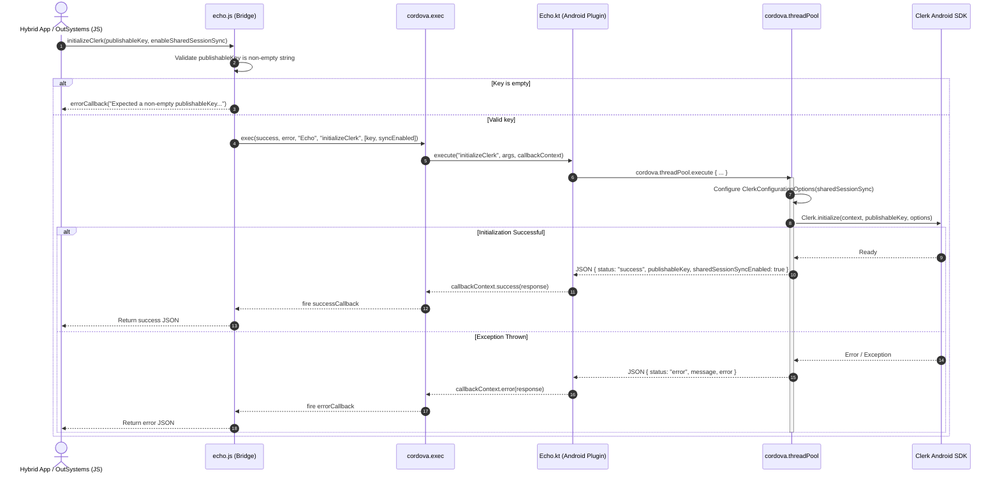
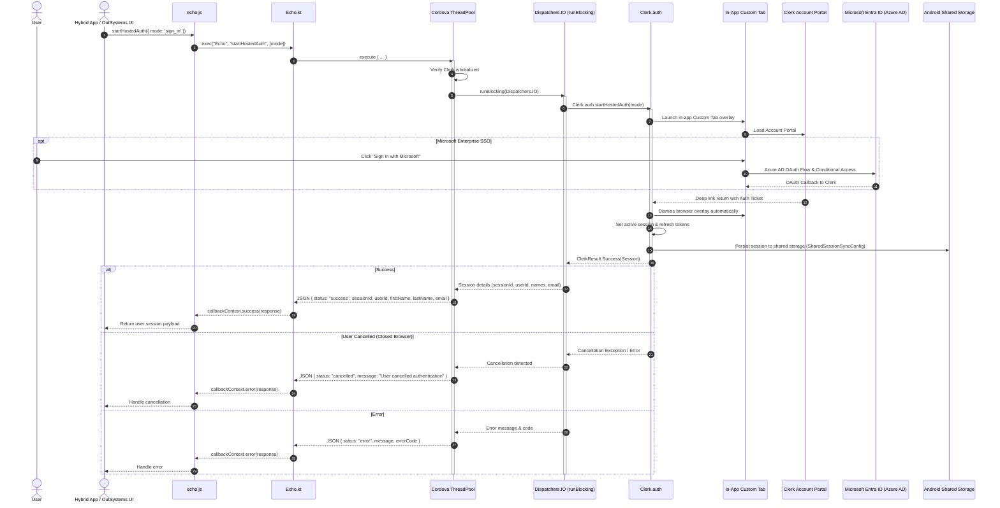
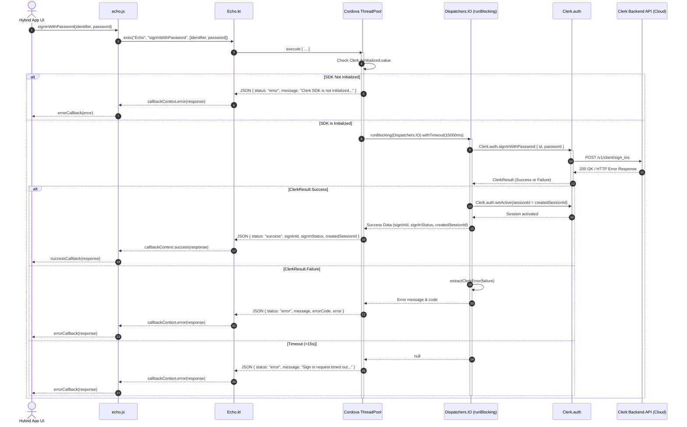
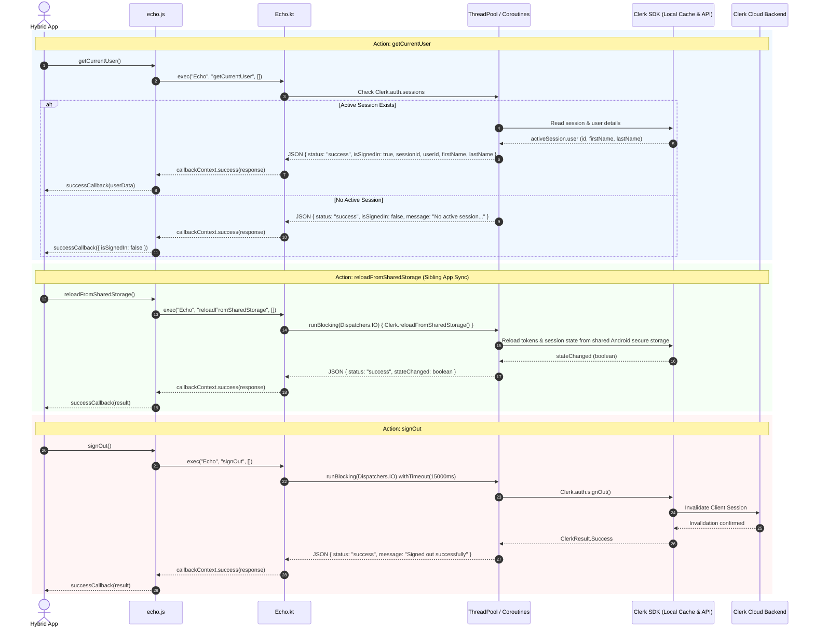
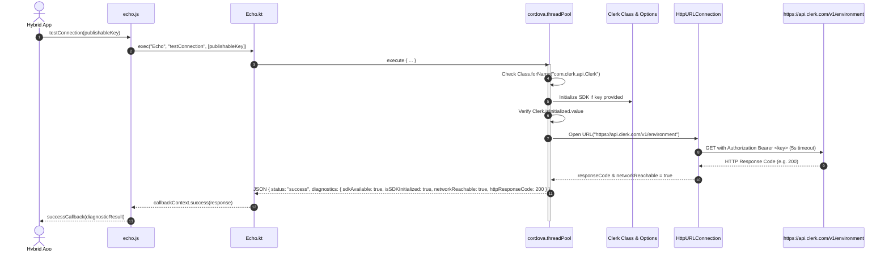

# Android Clerk Plugin Implementation & Sequence Architecture

This document provides a comprehensive technical breakdown of how the **Android Clerk Plugin** is structured, initialized, and executed within the hybrid Apache Cordova and OutSystems MABS (Mobile App Build Service) environment.

---

## 🏛️ Architecture Overview

The plugin bridges the web layer (JavaScript in the Cordova WebView) to the native Android environment via Cordova's native messaging bridge (`cordova.exec`), delegating asynchronous and network operations to background thread pools and Kotlin coroutines.

```
┌────────────────────────────────────────────────────────┐
│             Cordova WebView / JavaScript               │
│          (window.echo / cordova.plugins.echo)          │
└──────────────────────────┬─────────────────────────────┘
                           │ cordova.exec(...)
┌──────────────────────────▼─────────────────────────────┐
│          Cordova Android Plugin (Echo.kt)              │
│       - Action routing via execute()                   │
│       - Thread dispatch (cordova.threadPool)           │
│       - Coroutine IO dispatch (Dispatchers.IO)         │
│       - Timeout management (15000ms)                   │
│       - Reflection-based error extraction              │
└──────────────────────────┬─────────────────────────────┘
                           │
┌──────────────────────────▼─────────────────────────────┐
│          Clerk Android SDK (com.clerk.api)             │
│       - Clerk.initialize()                             │
│       - Clerk.auth.startHostedAuth() [OIDC / SSO]      │
│       - Clerk.auth.signInWithPassword()                │
│       - Clerk.auth.setActive()                         │
│       - Clerk.auth.signOut()                           │
│       - Clerk.reloadFromSharedStorage()                │
└──────────────────────────┬─────────────────────────────┘
                           │ HTTPS / TLS
┌──────────────────────────▼─────────────────────────────┐
│               Clerk Cloud Backend API                  │
│               (https://api.clerk.com)                  │
└────────────────────────────────────────────────────────┘
```

---

## 📊 Complete Sequence Diagrams

### 1. Initialization & SDK Verification (`initializeClerk` & `checkClerk`)



---

### 2. Hosted Authentication Flow (`startHostedAuth` - Microsoft Enterprise SSO / Account Portal)



---

### 3. User Authentication Flow (`signInWithPassword` & `setActive`)



---

### 3. Session Query, Shared Storage Sync & Sign-Out



---

### 4. Connection & Environment Diagnostic Pipeline (`testConnection`)



---

## 🔧 Core Implementation Details in `Echo.kt`

### 1. Thread Safety & Asynchronous Dispatch
All actions that perform network or disk I/O are executed on Cordova's background thread pool via `cordova.threadPool.execute { ... }` to prevent UI thread blocking.

### 2. Coroutine Bridging (`runBlocking` & `withTimeoutOrNull`)
Since the Clerk Android SDK exposes suspending Kotlin coroutines (`suspend fun`), the plugin utilizes:
```kotlin
runBlocking(Dispatchers.IO) {
    val result = withTimeoutOrNull(NETWORK_TIMEOUT_MS) {
        Clerk.auth.signInWithPassword {
            this.identifier = id
            this.password = pass
        }
    }
    // Handle result or timeout
}
```
A default timeout of `15000L` (15 seconds) protects the app against hanging on unstable mobile networks.

### 3. Reflection-Based Error Extraction (`extractClerkError`)
Clerk SDK failure structures (`ClerkResult.Failure`) encapsulate error details inside private/internal models. The `extractClerkError` helper inspects fields dynamically (`errors`, `longMessage`, `message`, `code`) to return clean, actionable error strings back to OutSystems/Cordova:
```kotlin
private fun extractClerkError(failure: com.clerk.api.network.serialization.ClerkResult.Failure<*>): Pair<String, String>
```

### 4. Shared Session Sync Configuration
Single Sign-On across sibling apps on Android is enabled during initialization:
```kotlin
val options = ClerkConfigurationOptions(
    sharedSessionSync = if (enableSharedSessionSync) SharedSessionSyncConfig.enabled else null
)
Clerk.initialize(context = context, publishableKey = key, options = options)
```

---

## 📦 Gradle & Build Configuration

- **SDK Dependency**: `com.clerk:clerk-android-api:1.1.1` configured in `plugin.xml`.
- **Kotlin Version**: Configured for Kotlin `2.0.21` with official code style.
- **Build Extras**: `src/android/build-extras.gradle` configures `-Xskip-metadata-version-check` to ensure compatibility across different Kotlin runtime versions in OutSystems MABS builds.
