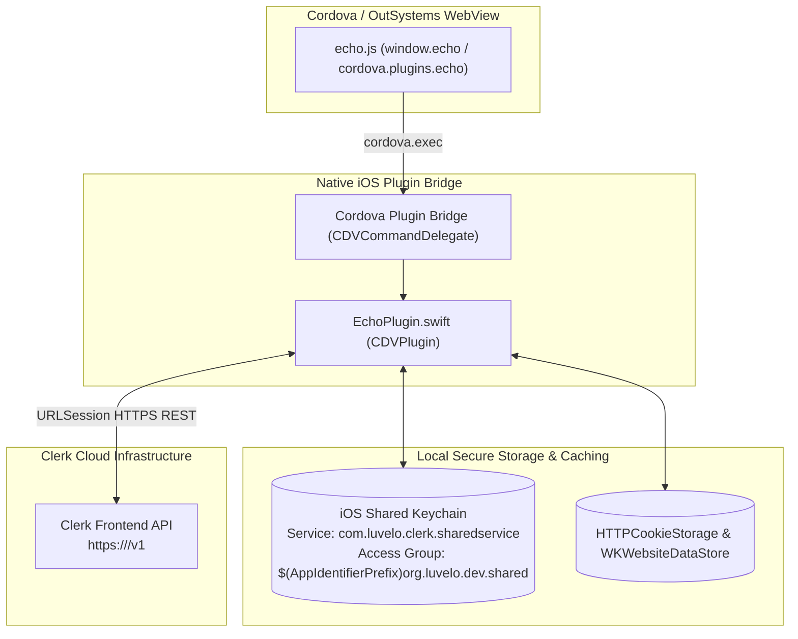
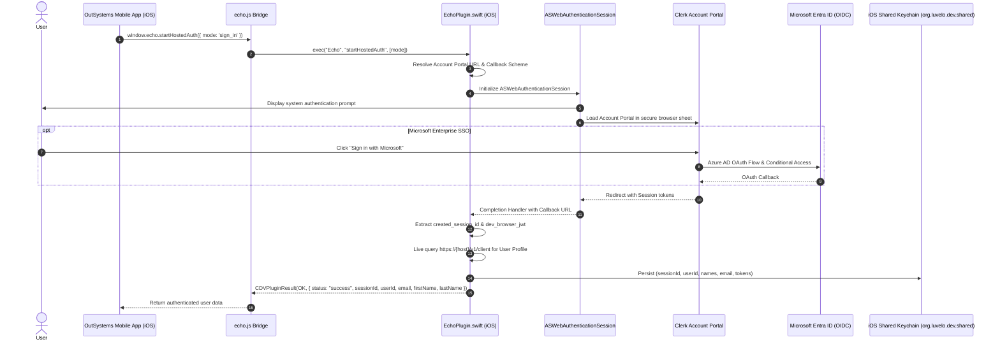
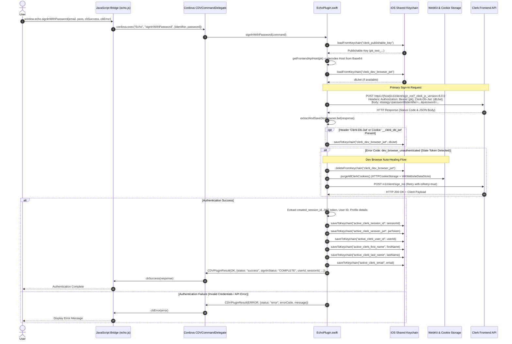
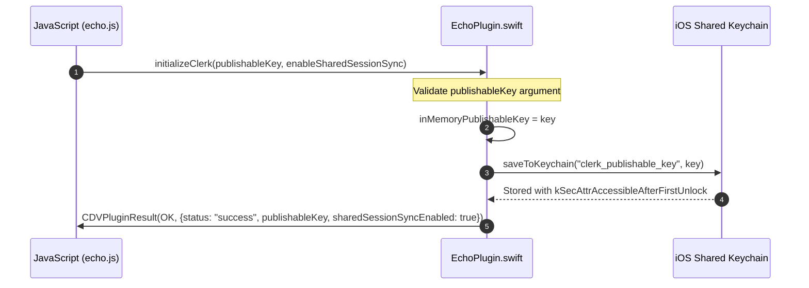
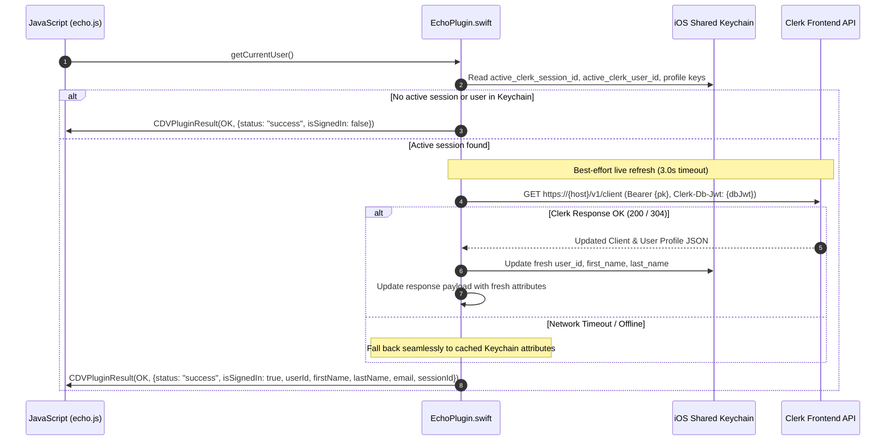
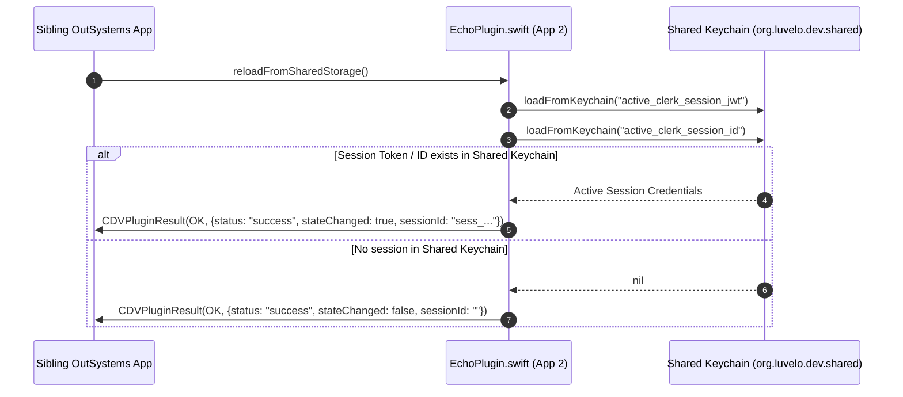
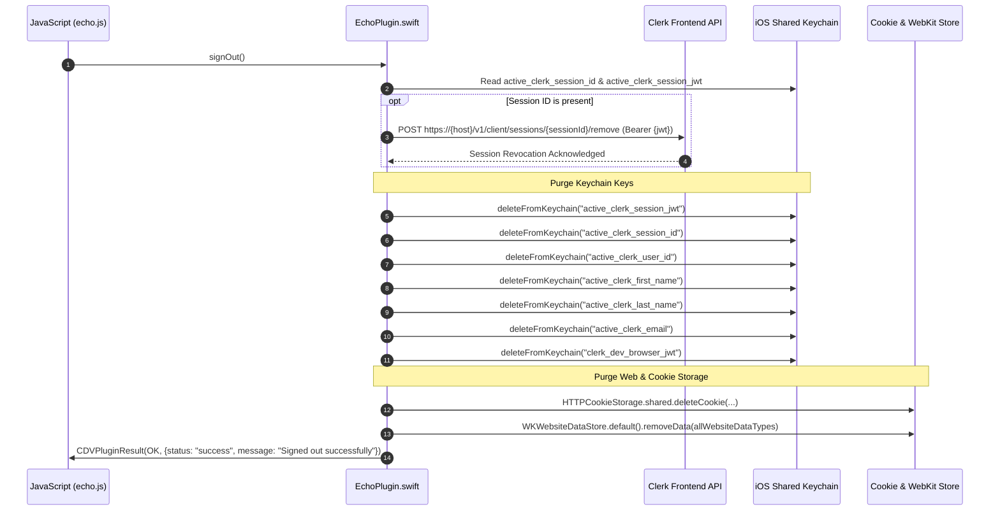
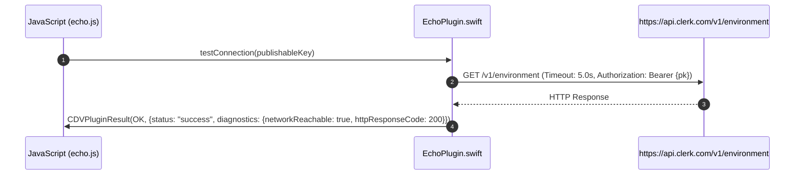

# iOS Clerk Plugin Implementation & Architecture Guide

A comprehensive architectural document and sequence specification for the **iOS Native Clerk Authentication Engine** in `cordova-plugin-echo` ([EchoPlugin.swift](src/ios/EchoPlugin.swift)).

---

## 📑 Table of Contents
1. [Architecture Overview](#-architecture-overview)
2. [Sequence Diagrams](#-sequence-diagrams)
   - [1. User Authentication (`signInWithPassword`)](#1-user-authentication-signinwithpassword)
   - [2. Plugin Initialization (`initializeClerk`)](#2-plugin-initialization-initializeclerk)
   - [3. Current User & Live Profile Refresh (`getCurrentUser`)](#3-current-user--live-profile-refresh-getcurrentuser)
   - [4. Cross-App Shared Session Sync (`reloadFromSharedStorage`)](#4-cross-app-shared-session-sync-reloadfromsharedstorage)
   - [5. Sign Out & Comprehensive Cache Purge (`signOut`)](#5-sign-out--comprehensive-cache-purge-signout)
   - [6. Connection Diagnostic Pipeline (`testConnection`)](#6-connection-diagnostic-pipeline-testconnection)
3. [iOS Shared Keychain Storage Specification](#-ios-shared-keychain-storage-specification)
4. [Publishable Key Decoding & Frontend API Host Discovery](#-publishable-key-decoding--frontend-api-host-discovery)
5. [Dev Browser Cookie Auto-Healing Mechanism](#-dev-browser-cookie-auto-healing-mechanism)
6. [OutSystems MABS Build & Entitlements Configuration](#-outsystems-mabs-build--entitlements-configuration)

---

## 🏛 Architecture Overview

The iOS implementation operates as a high-performance native Swift engine communicating directly with the **Clerk Frontend REST API** and Apple's **Security (Keychain) Framework**.



---

## 📊 Sequence Diagrams

### 1. Hosted Authentication (`startHostedAuth` - Microsoft Enterprise SSO & Account Portal)

Uses Apple's native **`ASWebAuthenticationSession`** to present Clerk's hosted Account Portal in a secure sheet overlay. Automatically supports **Microsoft Enterprise SSO (OIDC)**, Passkeys, Google/Apple login, and MFA, persisting authenticated session tokens into the Shared Keychain.



---

### 2. User Authentication (`signInWithPassword`)

Handles authentication using the Clerk Frontend API, dev-browser session coordination, automatic recovery from stale development tokens (`dev_browser_unauthenticated`), and secure session persistence to the shared iOS Keychain.



---

### 2. Plugin Initialization (`initializeClerk`)

Configures the native engine, caches the publishable key in memory, and persists it into the shared Keychain for cross-app sibling discovery.



---

### 3. Current User & Live Profile Refresh (`getCurrentUser`)

Performs a local Keychain lookup followed by a live, non-blocking background query to Clerk's `/v1/client` endpoint to synchronize profile changes.



---

### 4. Cross-App Shared Session Sync (`reloadFromSharedStorage`)

Allows sibling OutSystems applications sharing the same App Group entitlement (`org.luvelo.dev.shared`) to inherit login state without prompting the user to sign in again.



---

### 5. Sign Out & Comprehensive Cache Purge (`signOut`)

Revokes the session on Clerk's servers, purges all Keychain keys, and cleans all WebKit cookies and website data.



---

### 6. Connection Diagnostic Pipeline (`testConnection`)

Executes an isolated network probe to test connectivity with Clerk's central API (`api.clerk.com`).



---

## 🔑 iOS Shared Keychain Storage Specification

All credentials and profile attributes are stored using Apple's Security Framework with `kSecAttrAccessibleAfterFirstUnlock`.

* **Keychain Service:** `com.luvelo.clerk.sharedservice`
* **Entitlement Access Group:** `$(AppIdentifierPrefix)org.luvelo.dev.shared`

| Keychain Account Key | Data Type | Description |
| :--- | :--- | :--- |
| `clerk_publishable_key` | `String` | Clerk Publishable Key (`pk_test_...` or `pk_live_...`) |
| `active_clerk_session_jwt` | `String` | Active Clerk Client Session JWT used for Authorization headers |
| `active_clerk_session_id` | `String` | Active Clerk Session Identifier (`sess_...`) |
| `clerk_dev_browser_jwt` | `String` | Dev Browser Session Token (`__clerk_db_jwt`) for development environments |
| `active_clerk_user_id` | `String` | Clerk User Identifier (`user_...`) |
| `active_clerk_first_name` | `String` | User First Name |
| `active_clerk_last_name` | `String` | User Last Name |
| `active_clerk_email` | `String` | User Primary Email Address |

---

## 🔍 Publishable Key Decoding & Frontend API Host Discovery

Clerk Publishable Keys encode the target Frontend API Host in their third component:
`pk_test_<Base64EncodedHost>$`

The plugin decodes the host dynamically at runtime via `getFrontendApiHost(publishableKey:)`:
1. Strips prefix `pk_test_` or `pk_live_`.
2. Normalizes URL-safe Base64 padding (`-` to `+`, `_` to `/`, remainder modulo 4 padding `=`).
3. Decodes the UTF-8 string representation (e.g. `clerk.yourdomain.com` or `viable-badger-12.clerk.accounts.dev`).
4. Constructs HTTPS URLs for direct REST communication.

---

## 🛡️ Dev Browser Cookie Auto-Healing Mechanism

In Clerk development instances (`pk_test_...`), sessions require dev-browser synchronization via `_clerk_db_jwt`. If the dev-browser token expires or becomes invalid, Clerk returns:

```json
{
  "errors": [{
    "code": "dev_browser_unauthenticated",
    "message": "Dev browser unauthenticated"
  }]
}
```

**The iOS Plugin Auto-Healing Workflow:**
1. Intercepts `dev_browser_unauthenticated` error code.
2. Invokes `purgeAllClerkCookies()`, clearing:
   - `clerk_dev_browser_jwt` from iOS Keychain.
   - All cookies from `HTTPCookieStorage.shared`.
   - All website cache/cookies from `WKWebsiteDataStore.default()`.
3. Retries the sign-in request cleanly with `isRetry: true`.
4. Successfully completes sign-in without user friction.

---

## 🛠️ OutSystems MABS Build & Entitlements Configuration

The plugin automatically injects the necessary Keychain Sharing entitlements into all build variants via [plugin.xml](plugin.xml):

```xml
<!-- Keychain Sharing Entitlements for OutSystems MABS Cloud Builds -->
<config-file target="**/Entitlements-Debug.plist" parent="keychain-access-groups">
    <array>
        <string>$(AppIdentifierPrefix)org.luvelo.dev.shared</string>
    </array>
</config-file>

<config-file target="**/Entitlements-Release.plist" parent="keychain-access-groups">
    <array>
        <string>$(AppIdentifierPrefix)org.luvelo.dev.shared</string>
    </array>
</config-file>

<config-file target="**/*.entitlements" parent="keychain-access-groups">
    <array>
        <string>$(AppIdentifierPrefix)org.luvelo.dev.shared</string>
    </array>
</config-file>
```
